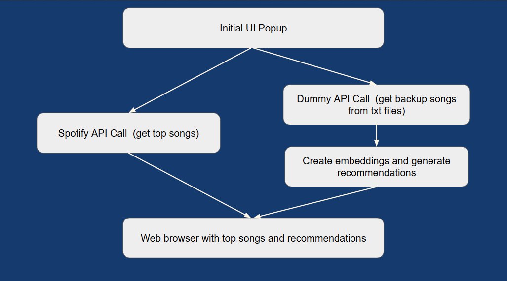

## Project Overview

While there are many listening summary dashboards available on the internet, they do not provide any song recommendations. This project’s purpose is to create song recommendations based on a user’s top five Spotify songs for the past month of their listening. It will automate the process of fetching a user’s recent top songs and generating recommendations based on lyric embeddings. A listener’s most popular tracks are constantly changing, and hence it will be helpful to automate this process. Given the same set of top songs, the same recommendations will be generated. However once again, since a user’s data is ever changing the recommendations will change over time. The only input the user has to give is to their external log in to spotify. Based on this, the user will know what their top songs are and what similar songs are based on lyric embeddings.

**1. fetch_top_tracks**

The first step is the initial UI popup. The user is prompted to either log in with Spotify or use backup presaved songs if they do not have a spotify account.
If the user chooses to log in with spotify, a browser will open for the user to log in with their personal spotify account. The user has 30 seconds to complete this process. If they do not log in in this time frame, it is assumed that there was some error, and a new popup encourages the user to utilize the backup option to still see an example of the dashboard. Otherwise, with a successful log in, a Spotify API call is made and their top 5 songs from a short term listening period are obtained. 
If the backup option is chosen, we access `backup_top_tracks.csv` and pull five ‘dummy songs,’ whose titles and artists we have hard-coded.

**2. fetch_song_lyrics**

After the user’s top 5 tracks (or our manual top 5 dummy tracks) are fetched, the lyrics for those songs are obtained. At the moment, we have no way of finding lyrics for songs found on Spotify due to copyright laws, however we do have lyrics saved as .txt files for our 5 manual dummy songs. 

**3. model_embeddings**

Our recommendations are generated based on song lyrics. In order to make those recommendations locally, we have included in this repository a dataset of ~57,000 songs and their lyrics. [The dataset comes from the popular data-sharing website Kaggle, and for each entry contains the song name, artist name, song lyrics, and a link to access the song.](https://www.kaggle.com/datasets/notshrirang/spotify-million-song-dataset?resource=download) For each song in the dataset, we have calculated embeddings for its lyrics [using the all-MiniLM-L6-v2 sentence transformer model found on huggingface](https://huggingface.co/sentence-transformers/all-MiniLM-L6-v2). Embeddings were then stored in the file `song_embeddings_miniLM.npz`

**4. fetch_recommendations**

After having generated embeddings for the songs in our dataset, we then generate embeddings for the top 5 tracks from `fetch_song_lyrics`. Those embeddings are compared to the existing embeddings in our dataset, and the top 3 similar embeddings (based on cosine similarity) are chosen as the recommended songs. Note that this process only works for songs whose lyrics we have (ie, the dummy songs), and so for top tracks fetched using Spotify, we have hard-coded fake recommendations that are produced identically for each song regardless of its lyrical content.

**5. generate_dashboard**

The final step is to create a dashboard for the top songs and recommendations. A visual is generated using plotly and saved as `song_report.html`. We then implemented a force pop-up to open this file in a default browser. Here, the user can easily see their top songs and three recommendations for each.

## Workflow Diagram

## Quick Start

This project relies heavily on the Spotify API through the Spotify Developer tool. In order to run the process with actual user information, see the “Key File” section. If you do not go through this process, running in real mode will be disabled, but you will still be able to run the program in dummy mode by selecting “I don’t have spotify, show me an example” on the initial UI popup.

This project utilizes UV for version control. If you are unfamiliar with UV, please see their documentation for more information on its implementation. Once you have downloaded the repository, make sure you are located at its root directory and simply run the command `uv sync` to set up all necessary packages.

After successfully running `uv sync`, please run the command `uv run .\main.py` in order to summon the pop-up window to interact with our project.

## Key File

In the process of pulling real Spotify data, we had to utilize the proprietary Spotify API, which came with lots of guardrails that we had to navigate through the course of our code.

In order for our login with Spotify to work, the repository must contain a key file, which consists of a CLIENT_ID, CLIENT_SECRET, and REDIRECT_URI. This key file is not available on our public repository, but must be present for the Spotify API to work.

In order to add your own key file, please perform the following steps:

1. Access https://developer.spotify.com/ and log in with your Spotify account.
2. Create a new app (or access and existing one), and add the following Redirect URI to the app: http://127.0.0.1:8080/callback
3. Create a file called `key.json`, containing the following information:

	{"SPOTIFY_CLIENT_ID": paste your client ID here as a string,

   "SPOTIFY_CLIENT_SECRET":paste your client Secret here as a string,
   
   "REDIRECT_URI":"http://127.0.0.1:8080/callback"}

5. Save `key.json` in our directory with the following filepath: `src/fetch_top_tracks/key.json`
---
*project created by Kailyn Pudleiner and Katy Lenshin for DATA 440: Automation & Workflows at the College of William & Mary*
